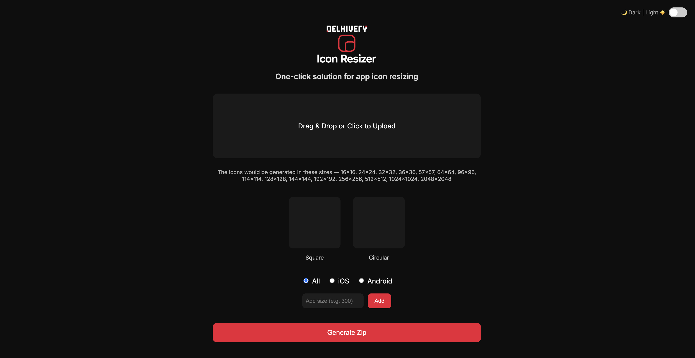

<p align="center">
  <picture>
    <source media="(prefers-color-scheme: dark)" srcset="app-icon-resizer-logo.png">
    <source media="(prefers-color-scheme: light)" srcset="resizer-logo-black.png">
    
  </picture>
</p>

# 🧩 Delhivery Icon Resizer — One-Click App Icon Generator

A lightweight, browser-based tool to instantly generate **app icons** for iOS, Android, and universal platforms.  
Built for simplicity, precision, and brand consistency — with a clean dark/light themed UI.

---

## ✨ Features

- ⚙️ **One-click icon resizing**  
  Drag & drop or click to upload any image (supports PNG, JPG, GIF, BMP, TIFF, etc.)
- 🖼️ **Automatic masking**  
  Generates both **square** and **circular** transparent icons
- 📱 **Platform-specific outputs**  
  - **iOS** — App Store & iDevice standard sizes  
  - **Android** — density-based adaptive icons  
- 🌓 **Dark / Light Theme Toggle**  
  - Default **dark mode** 🌙  
  - Switch to **light mode** ☀️ via labeled toggle: `🌙 Dark | Light ☀️`  
  - Remembers user preference via `localStorage`
- 🖼️ **Automatic Logo Switching**  
  - Dark mode → `app-icon-resizer-logo.png`  
  - Light mode → `resizer-logo-black.png`  
- 💾 **Smart ZIP Naming**  
  - ZIP filename matches your uploaded image  
  - Example: `brand-logo-icons.zip`
- 🧩 **Organized output folders**  
  - Square, Circular, iOS, and Android folders inside the ZIP  
- 🎨 **Modern Flat UI**  
  - Inter font family  
  - Brand accent color: `#ED1B36`  
  - Flat and clean — no shadows or hover effects  
- 💠 **Includes Favicon**  
  - Custom `favicon.png` included for easy branding

---

## 🖥️ Preview

Here’s a visual look at the live app 👇

*(You can replace this with your actual screenshot)*  


> *Dark mode by default — switchable to light mode instantly.*

---

## 🚀 How to Use

1. Open the app in your browser (via GitHub Pages or local environment).
2. **Drag & Drop** or **Click to Upload** your image.
3. The app automatically generates:
   - 🟥 Square icons  
   - ⚪ Circular icons  
   - 🍏 iOS icons  
   - 🤖 Android icons  
4. Choose your desired platforms and click **Generate Zip** to download all resized icons.

---

## 🧱 Output Structure

```
📦 icons.zip
 ┣ 📂 square/
 ┣ 📂 circular/
 ┣ 📂 iOS/
 ┗ 📂 Android/
```

Each folder contains PNG icons in predefined resolutions and naming conventions.

---

## 🧑‍💻 Technical Details

- **Frontend:** HTML, CSS, Vanilla JavaScript  
- **Libraries:** [JSZip](https://stuk.github.io/jszip/) for ZIP packaging  
- **Masks:** Embedded transparent PNG masks for circular and iOS squircle shapes  
- **Hosting:** 100% client-side — ready for GitHub Pages or any static host

---

## 🪄 Deployment on GitHub Pages

1. Upload the following files to your repository:
   ```
   index.html
   style.css
   script.js
   app-icon-resizer-logo.png
   resizer-logo-black.png
   favicon.png
   ```
2. Go to **Settings → Pages**  
   - Source: `Deploy from a branch`  
   - Branch: `main` → `/ (root)`
3. Wait 30–60 seconds for GitHub to publish your page.
4. Access your deployed site at:
   ```
   https://<your-username>.github.io/<your-repo-name>/
   ```

---

## 👤 Credits

**Made by [Orion Jose](https://www.orioncjose.com)**  
Design & Development © 2025 — All rights reserved.

---

## 📄 License

Released under the MIT License.  
Attribution appreciated but not required.
